# CommercePilot AI 🚀
### *"From Customer Intent to Completed Purchase — Autonomously."*
**Track 1: AI Growth & Agentic Commerce — Razorpay AI Buildathon**

---

## 🌟 Executive Overview
**CommercePilot AI** is an autonomous agentic commerce platform built for high-growth e-commerce merchants. Traditional commerce tools wait passively for shoppers to formulate exact search terms, compare technical specifications, add items to a cart, and reach checkout.

CommercePilot transforms commerce from passive browsing into an **autonomous proactive growth engine**. By orchestrating **10 specialized AI agents**, CommercePilot understands unstructured customer intent, ranks catalog products with explainable reasoning, guards merchant profit margins by eliminating unnecessary discounting, recovers abandoned carts with tailored stock nudges, and generates executive business intelligence.

---

## 🏛️ System Architecture

```mermaid
flowchart TB
    subgraph ShopperExperience ["Shopper Experience (/store)"]
        ShopperInput["Natural Language Intent Search"]
        Catalog["Catalog & Filtering (Best Match, Budget, Value)"]
        PDP["Product Detail + 'Ask AI' + AI Reasoning"]
        SmartCart["Smart Cart + AI Complementary Upsell"]
        SmartCheckout["Smart Checkout (Razorpay Simulation)"]
        ShoppingAssistant["Floating AI Commerce Advisor"]
    end

    subgraph AgentOrchestrator ["Autonomous AI Agent Swarm (10 Agents)"]
        Orchestrator["Master Orchestrator Agent"]
        IntentAgent["1. Shopping Intent Agent"]
        DiscoveryAgent["2. Product Discovery Agent"]
        AdvisorAgent["3. Commerce Advisor Agent"]
        PersonalizationAgent["4. Personalization Agent"]
        OfferAgent["5. Offer Optimization Agent"]
        RecoveryAgent["6. Cart Recovery Agent"]
        CrossSellAgent["7. Upsell & Cross-Sell Agent"]
        RetentionAgent["8. Customer Retention Agent"]
        GrowthAgent["9. Growth Insights Agent"]
    end

    subgraph MerchantDashboard ["Merchant Control Plane (/dashboard)"]
        Overview["Executive KPI & AI Impact Dashboard"]
        CommandCenter["AI Commerce Command Center"]
        DecisionTrace["Transparent AI Decision Trace"]
        HumanInLoop["Human-in-the-Loop Approvals"]
        AbandonedCartIntel["Abandoned Cart Intelligence"]
        Customer360["Customer 360 Intelligence"]
        CampaignBuilder["AI Campaign Builder"]
        SimulationEngine["Hero Demo Simulation Engine"]
        Analytics["Funnel & Attribution Analytics"]
        Settings["Autonomy Controls & Configuration"]
    end

    ShopperInput --> IntentAgent
    IntentAgent --> DiscoveryAgent
    DiscoveryAgent --> PersonalizationAgent
    PersonalizationAgent --> Catalog
    ShoppingAssistant <--> AdvisorAgent
    SmartCart <--> CrossSellAgent
    SmartCart --> OfferAgent
    SmartCart -.-> RecoveryAgent
    RecoveryAgent --> HumanInLoop
    RecoveryAgent --> DecisionTrace
    SmartCheckout --> RetentionAgent

    Orchestrator --> IntentAgent
    Orchestrator --> GrowthAgent
    GrowthAgent --> Analytics
    GrowthAgent --> CampaignBuilder
    SimulationEngine --> RecoveryAgent
    SimulationEngine --> MerchantDashboard
```



---

## 🤖 The 10 Specialized AI Agents

| Agent | Core Responsibility | Autonomous Capability |
| :--- | :--- | :--- |
| **1. Shopping Intent Agent** | Natural Language Parser | Extracts product category, hard budget ceilings, primary use cases, and purchase intent scores (0–100). |
| **2. Product Discovery Agent** | Catalog Re-ranking | Shortlists Best Match, Best Value, Budget Pick, and Premium Choice with transparent "Why this matches" bullets. |
| **3. Commerce Advisor Agent** | Conversational Advisor | Grounded Q&A, specs comparisons, and student/workplace suitability checks without hallucination. |
| **4. Personalization Agent** | Customer 360 Profiler | Aggregates browse sequences, cart history, and order frequencies to build price sensitivity scores. |
| **5. Offer Optimization Agent** | Margin Guard | Evaluates purchase intent to prevent unnecessary margin waste. Withholds discounts if conversion intent is already high. |
| **6. Cart Recovery Agent** | Abandonment Interceptor | Detects cart inactivity and triggers personalized stock urgency reminders without margin erosion. |
| **7. Upsell & Cross-Sell Agent** | Peripheral Matcher | Pairs hardware with contextually verified companion accessories (e.g. laptop with dual 4K dock & sleeve). |
| **8. Customer Retention Agent** | Lifecycle Automation | Nurtures buyers post-purchase with onboarding guides, care tips, and timely replenishment windows. |
| **9. Growth Insights Agent** | Business Intelligence | Analyzes storefront funnel telemetry, identifies latency bottlenecks, and generates 1-click growth strategies. |
| **10. Master Orchestrator** | Event Bus & Coordinator | Intelligently routes events to the precise agent pipeline required rather than executing monolithic steps. |

---

## 🎯 Razorpay Buildathon Judging Criteria Alignment

### 1. Problem Taste
- Online merchants lose **~70% of potential revenue to cart abandonment** and frequently bleed **15–20% in profit margins** by blindly blasting blanket discount codes.
- CommercePilot solves this by determining whether an incentive is strictly necessary, maintaining full gross margins on high-intent buyers, and recovering lost carts through relevant reassurance.

### 2. Build Quality
- **Real-world SaaS Stack**: Next.js 14 App Router, TypeScript, Tailwind CSS, Prisma ORM, and Recharts.
- **Persistent Database**: 111 rich products across 8 categories, 55 realistic customer profiles with behavioral timelines, 110 completed orders, 15 abandoned carts, and 25+ transparent decision traces.
- **Zero Placeholder/Fake Buttons**: Every action mutates the database, updates telemetry, logs to the audit trail, and generates notifications.

### 3. AI Judgment vs Deterministic Logic
- **AI is used for**: Unstructured intent parsing, multi-constraint semantic ranking, customer segmentation, conversational advice, margin defense, and root cause discovery.
- **Deterministic logic is used for**: Cart totals, tax calculations, inventory reservations, order state transitions, and authentication.
- **Human-in-the-Loop**: High-value proposals (discounts > ₹8,000 or orders > ₹1,00,000) automatically escalate to the **Approvals Center** for merchant review.

### 4. Failure Recovery & Dual-Engine Resilience
- **Dual-Engine Architecture**: Integrated with Google Gemini API (`GEMINI_API_KEY`), but includes a robust, production-grade **Deterministic Heuristic Engine**.
- If external LLM APIs fail, face rate limits, or have missing credentials, the system automatically falls back without crashing or disrupting user flows.

---

## ⚡ Quickstart & Local Setup

### Prerequisites
- Node.js 18+ or Node.js 20+
- npm

### 1. Clone & Install
```bash
git clone <repo-url>
cd "AI GROWTH & AGENTIC COMMERCE"
npm install
```

### 2. Configure Environment
Create or verify `.env`:
```env
DATABASE_URL="file:./dev.db"
GEMINI_API_KEY="" # Optional: Works out of the box with heuristic engine if empty
RAZORPAY_KEY_ID="rzp_test_demo_commercepilot"
RAZORPAY_KEY_SECRET="demo_secret"
NEXT_PUBLIC_APP_URL="http://localhost:3000"
NEXT_PUBLIC_DEMO_MODE="true"
```

### 3. Initialize Database & Seed
```bash
npx prisma generate
npx prisma db push
npx tsx prisma/seed.ts
```

### 4. Run Development Server
```bash
npm run dev
```
Open **[http://localhost:3000](http://localhost:3000)** in your browser.

---

## 🎬 Hero Demo Scenario Walkthrough (For Judges)

1. Open **[http://localhost:3000/dashboard](http://localhost:3000/dashboard)** to view executive metrics (Total GMV: ₹51.6L, AI-Attributed Revenue: ₹37.2L, Recovered Carts: ₹1.84L).
2. Click **"Run Hero Simulation"** or navigate to **`/dashboard/simulation`**.
3. **Step 1 — Intent Search**: Rahul Sharma searches *"I need a laptop for coding under ₹80,000"*. Observe the Shopping Intent Agent extract the ₹80k budget cap and rank the Zenith Pro 16 Ultrabook as a 94% match.
4. **Step 2 — Abandon Cart**: Rahul adds the ₹74,999 laptop to cart and leaves at checkout. The Cart Recovery Agent detects High Abandonment Risk (92/100 intent) and selects a **zero-discount stock urgency reminder** to protect merchant margin.
5. **Step 3 — Autonomous Recovery**: Click **"Simulate Recovery"**. Rahul returns via the AI nudge, completes simulated Razorpay payment, and **₹74,999 is recovered into live GMV**.
6. Return to **`/dashboard`** to see metrics and AI decision streams update in real time!

---

## 💳 Razorpay Payment Integration & Simulation
- Dedicated abstraction in `src/lib/payment-service.ts`.
- Supports instant **UPI, Cards, and NetBanking** simulation.
- Designed with clear labels: **"Simulation Mode / Demo Checkout"** ensuring full transparency.
- Readily connects to production Razorpay API keys with zero architectural rework.

---

## ⌨️ Productivity Features
- **Global Command Palette (`⌘K` / `Ctrl+K`)**: Instant keyboard navigation across customers, products, orders, agents, and simulation runs.
- **AI Decision Trace Modal**: Step-by-step audit showing Event → Context → Intent → Risk → Candidate Options → Decision → Confidence → Outcome.
- **Notification Center**: Real-time alerts for high-value abandoned carts and pending human approvals.

---

## 🔐 Credentials for Testing
- **Demo Account**: `demo@commercepilot.ai`
- **Password**: `pilot2026`
- **1-Click Demo Login**: Available directly on `/login` and `/onboarding`.
